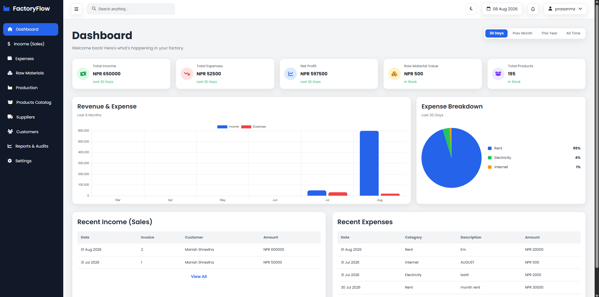

# FactoryFlow

A factory management system for a shoe manufacturing business — tracks raw
materials, production batches, finished stock, sales, expenses, and the
people on both ends of that chain.

Built with Django. No frontend framework: server-rendered templates, plain
CSS, and vanilla JavaScript.

---

## Screenshots



| Dashboard (dark) | Dashboard (light) |
|---|---|
| _add screenshot_ | _add screenshot_ |

---

## What it does

**Dashboard** — income, expenses, net profit, raw material value and total
product stock, filtered by 30 Days / Previous Month / This Year / All Time.
Six-month revenue trend and an expense breakdown by category.

**Income (Sales)** — record a sale against a customer and product, with
invoice number, channel, unit price and payment status. Selling reduces
finished-goods stock.

**Expenses** — categorised operating costs with per-category totals.

**Raw Materials** — purchases from suppliers, running stock levels, stock
valuation, and reorder warnings.

**Production** — batch runs with target, produced and defective quantities.
Completing a batch adds good units to product stock.

**Products Catalog** — SKU, category, brand, colour, size, cost and selling
price, stock level and reorder threshold.

**Suppliers & Customers** — contact records with searchable directories and
per-record purchase and sales totals.

**Reports** — revenue, cost and margin summaries with an Excel export.

**Settings** — company details, currency, date format, document prefixes,
tax rate, auto-logout, password change, and JSON backup/restore.

**Dark mode** — a theme toggle in the navbar, remembered per browser.

---

## Built with

| | |
|---|---|
| Backend | Django 6.0 · Python 3.12+ |
| Database | SQLite |
| Frontend | Django templates · vanilla CSS · vanilla JS |
| Charts | Chart.js |
| Export | openpyxl |

CSS is organised as one file per page plus shared `variables.css`,
`layout.css`, `navbar.css` and `sidebar.css`. Theming works through CSS
custom properties — the dark theme redefines the same variable names under
`html[data-theme="dark"]`, so a single attribute on `<html>` swaps the
whole palette.

---

## Running it locally

Requires Python 3.12 or newer.

```bash
git clone https://github.com/prasantamangofficial/Factory-Flow
cd Factory-Flow

python -m venv venv
venv\Scripts\activate          # Windows
# source venv/bin/activate     # macOS / Linux

pip install -r requirements.txt

cd backend
python manage.py migrate
python manage.py createsuperuser
python manage.py runserver
```

Open http://127.0.0.1:8000 and sign in with the superuser you just created.

The database ships empty. Add a few suppliers, raw materials and products
first — sales and production runs reference them.

---

## Project layout

```
backend/
├── config/           # settings, root urls
├── dashboard/        # KPIs and chart endpoints
├── income/           # sales
├── expenses/
├── raw_materials/    # materials and purchases
├── production/       # batch runs
├── products/         # finished goods catalog
├── suppliers/
├── customers/
├── reports/          # summaries and Excel export
├── settings_app/     # site configuration singleton
├── templates/        # base.html + one per page
└── static/
    ├── css/          # variables, layout, one file per page
    └── js/           # charts and theme toggle
```

Each Django app owns its own models, views, forms and admin registration.
Templates and static files are shared at project level rather than per app.

---

## Backup

Settings → **Download Backup** exports every business record as a JSON
fixture. Settings → **Restore** reads one back.

The export deliberately excludes sessions, password hashes and admin logs —
it carries your data, not your installation. Restore validates that the
uploaded file only contains models this app owns, and runs inside a
transaction, so a failure rolls back rather than leaving a half-applied
state.

`backend/db.sqlite3` is gitignored. Cloning this repo does **not** clone the
data.

---

## Known limitations

Honest list, in rough order of how much they matter:

- Raw material `unit_cost` is overwritten by the most recent purchase price
  rather than averaged, so buying at a new price revalues existing stock
- Dashboard and Reports calculate net profit differently
- No pagination; production and raw material lists cap at 20 rows
- Delete is immediate on several pages, with no confirmation step
- The navbar search box is not wired up
- Raw materials can only be created through the Django admin
- Charts keep their colours until reload when the theme is switched

---

## Not production ready

This runs with Django's development server and development settings.
Before deploying anywhere public:

- Rotate `SECRET_KEY` and read it from an environment variable — the key in
  this repo's history must be considered compromised
- Set `DEBUG = False`
- Set `ALLOWED_HOSTS`
- Serve static files properly (`collectstatic` + WhiteNoise or a web server)
- Move to PostgreSQL if the host has an ephemeral filesystem

---

## Author

**Prasan Tamang** — [@prasantamangofficial](https://github.com/prasantamangofficial)